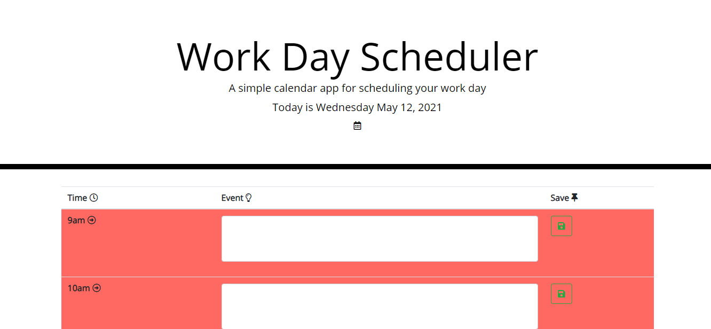
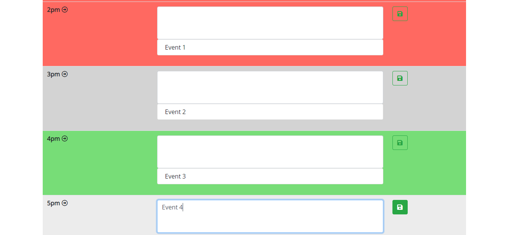

# Workday Scheduler

View Live Webpage!
https://alec74.github.io/workdayPlanner/

This weeks project was to refactor a workday planner to add functionality, time specific display and storage capabilities. This scheduler will preview timeblocks for every hour of the workday from 9am to 5pm. The user is able to input events and submit them for each time block so they can be saved and displayed.

The objectives to complete this project include the following:
* The current day of the week is displayed at the top of the page
* Time blocks for standard business hours are present
* Each time block is color coded based on if it is in the past, present, or future
* Ability to add events to timeblocks by clicking the input field
* After saving the timeblock the text is added to local storage
* If the page is refreshed then the saved events persist

Technologies used: 
* HTML
* CSS 
* Javascript
* Bootstrap
* Google Fonts
* Font Awesome
* JQuery
* Moment.js

Welcome to the webpage

Add and event

Contact Information:
* Github: https://github.com/Alec74
* Email: alecmcglone@gmail.com
* LinkedIn: https://www.linkedin.com/in/alec-mcglone-900904206/