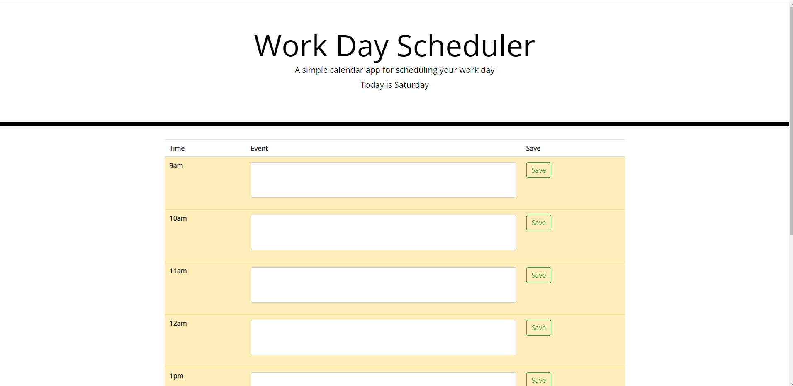

# Unit 5 Homwork

This weeks project was to refactor a workday planner to add functionality, time specific display and storage capabilities.

The objectives to complete this homework include the following:
* The current day of the week is displayed at the top of the page
* Time blocks for standard business hours are present
* Each time block is color coded based on if it is in the past, present, or future
* Ability to add events to timeblocks by clicking the input field
* After saving the timeblock the text is added to local storage
* If the page is refreshed then the saved events persist

View Live Webpage!
https://alec74.github.io/codeQuiz/